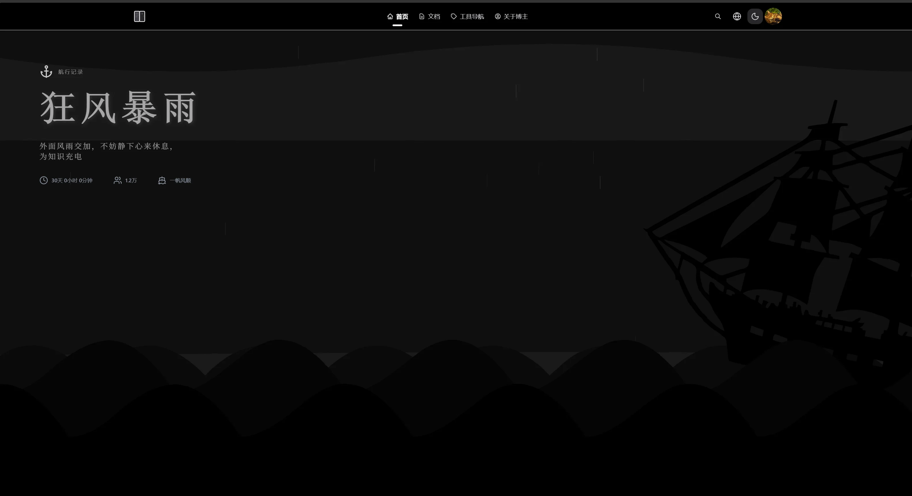
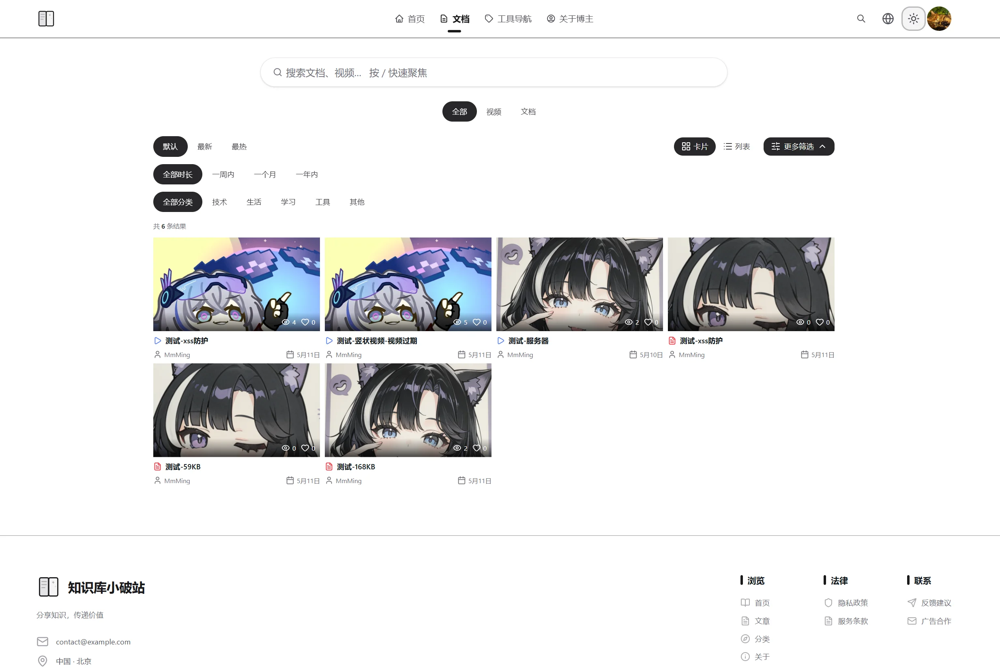
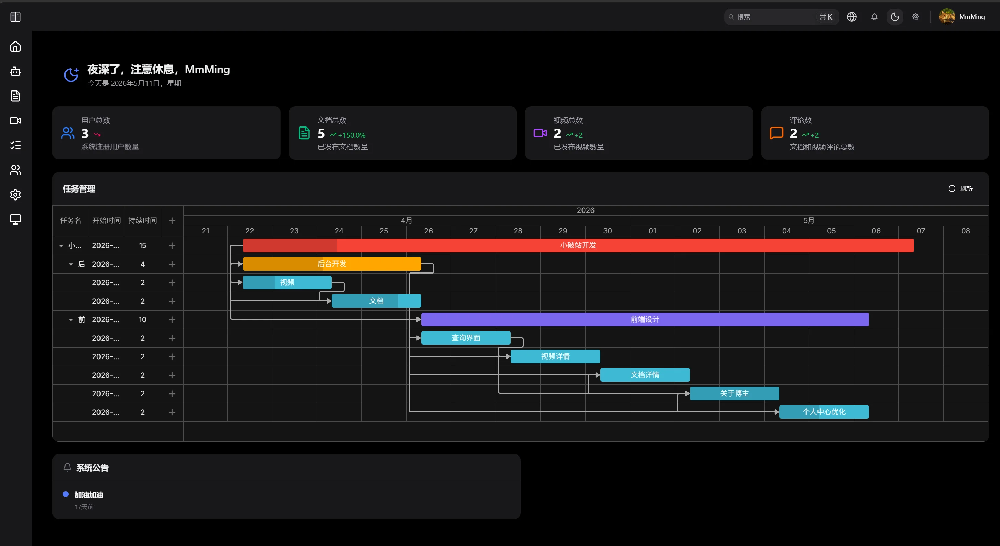
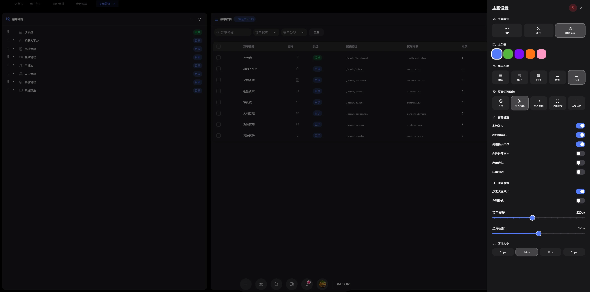
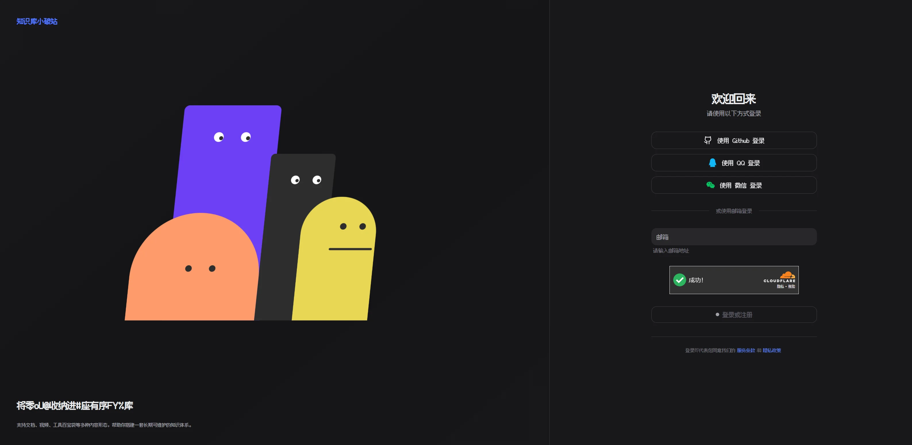

# 知识库小破站前端 (zsk-ui-v2)

基于 React 19 + Vite 7 + TypeScript 的企业级前端应用，包含前台门户与后台管理双布局，使用 HeroUI 作为默认组件库。

## 项目概述

本项目是一个前后台分离的前端应用，采用双布局架构：

- **前台门户**：面向普通用户的展示界面
- **后台管理**：面向管理员的操作界面
- **登录认证**：统一的登录入口与认证回调

## 功能模块

### 前台门户

前台门户是面向普通用户的主要展示界面，包含以下功能页面：

- **门户首页**：全屏沉浸式 Banner 设计，包含动态背景元素（波浪、小船、闪电、雨滴），支持深色/浅色主题切换
- **关于博主**：博主信息展示、技术栈跑马灯、技术成长热力图、气泡弹窗对话交互
- **文档详情**：左-中-右三栏布局，左侧装饰光束、中间主内容区渐进式加载、右侧悬浮目录导航，支持评论区功能
- **视频详情**：视频播放器、视频信息展示、面包屑导航、视频合集、评论互动、回顶滑块
- **用户详情**：用户作品主页，包含用户信息展示、数据统计、作品筛选、作品网格展示、右侧悬浮侧边栏
- **个人中心**：编辑个人信息、管理作品、消息管理、账号安全设置
- **全站搜索**：搜索入口、搜索结果展示、筛选排序、响应式布局
- **404 页面**：错误提示、友好信息展示、返回首页/上一页按钮

访问路径：`/`


**前端截图**：





### 后台管理

后台管理是面向管理员的操作界面，包含以下功能模块：

**仪表盘**
- **数据概览**：欢迎语动态展示、系统数据统计、可视化图表

**人员管理**
- **用户管理**：系统用户列表展示，支持分页、搜索、筛选；用户新增、编辑、删除、重置密码、启用/禁用操作
- **角色管理**：系统角色列表，支持搜索、筛选、本地分页；角色权限配置与分配
- **菜单管理**：后台菜单列表查询，支持按菜单名称、状态、类型筛选；动态菜单配置

**文档管理**
- **文档列表**：文档列表展示，支持分页、搜索、筛选；文档基本信息与操作
- **文档创建与编辑**：文档编辑与上传统一入口，支持创建新文档和编辑已有文档

**视频管理**
- **视频上传**：视频文件上传，包含选择文件、上传进度显示
- **视频列表**：视频资源列表，支持分页、搜索、筛选
- **视频合集管理**：视频合集创建、编辑、删除；相关视频归类管理

**机器人平台**
- **QQ 机器人**：QQ 机器人配置，包含 QQ 号、名称、头像；启动、停止、重启管理
- **NapCat 机器人**：NapCat 机器人配置，支持连接、断开、重启操作
- **微信机器人**：微信机器人配置，包含账号管理、消息管理、自动回复
- **钉钉机器人**：钉钉机器人配置，包含账号管理、消息管理、自动回复

**审批流**
- **前台审批**：前台内容审核队列展示，支持筛选、通过审核、驳回审核等操作

**系统管理**
- **参数配置**：系统参数查看、修改、保存
- **字典管理**：系统字典项增删改查

**系统运维**
- **用户行为**：用户登录日志和操作行为记录分析
- **系统日志**：系统运行日志查看、搜索、筛选
- **缓存列表**：系统缓存信息查看与操作
- **通知公告**：公告发布、编辑、历史公告查看

访问路径：`/admin/*`

权限控制：需要登录后才能访问，未登录用户自动重定向到登录页。

**前端截图**：





### 登录认证

登录模块提供统一的认证入口，支持以下功能：

- **魔法链接登录**：用户输入邮箱地址，通过邮件接收魔法链接完成登录
- **人机验证**：集成 Cloudflare Turnstile 人机验证，防止恶意登录
- **第三方登录**：支持 OAuth 等第三方登录方式
- **登录状态持久化**：登录态本地存储，支持自动登录
- **登录后自动跳转**：登录成功后自动跳转至目标页面

**登录流程**：
1. 用户输入邮箱地址
2. 完成人机验证
3. 系统发送魔法链接至邮箱
4. 用户点击邮件中的链接完成验证
5. 登录态写入，自动跳转

访问路径：`/login`、`/auth/callback`

权限控制：已登录用户访问登录页会自动重定向到首页。

**前端截图**：



## 技术栈

| 类别 | 技术 | 版本 |
|------|------|------|
| 框架 | React | ^19.2.0 |
| 构建工具 | Vite | ^7.2.4 |
| 类型系统 | TypeScript | ~5.9.3 |
| 组件库 | HeroUI | ^2.8.8 |
| 样式 | Tailwind CSS | ^4.1.18 |
| 路由 | React Router DOM | ^7.12.0 |
| 状态管理 | Zustand | ^5.0.9 |
| HTTP 客户端 | Axios | ^1.13.2 |
| 动画 | Framer Motion | ^12.34.3 |
| 图标 | Lucide React | ^0.562.0 |
| 数据可视化 | ECharts | ^5.6.0 |
| 国际化 | i18next | ^25.8.13 |
| 富文本编辑 | Milkdown + WangEditor | ^7.20.0, ^5.1.23 |
| 视频播放 | Vidstack React | ^1.12.13 |
| Markdown | React Markdown | ^10.1.0 |
| 3D | Three.js | ^0.182.0 |

## 项目结构

```
src/
├── main.tsx              # 应用入口
├── App.tsx               # 根组件（包含 Provider 链）
├── provider.tsx          # Provider 配置
├── components/           # 业务组件
│   ├── ui/              # UI 基础组件库
│   ├── common/          # 全局通用组件（GlobalModal、Watermark）
│   └── ...
├── pages/               # 页面组件（路由对应）
│   ├── FrontLayout.tsx  # 前台布局
│   ├── AdminLayout.tsx  # 后台布局
│   ├── AuthLayout.tsx   # 认证页面布局
│   └── ...
├── router/              # 路由配置
│   └── index.tsx        # 集中路由定义（使用 lazy + Suspense）
├── hooks/               # 自定义 React 钩子
│   ├── useTheme.ts      # 主题系统（唯一权威入口）
│   ├── useLocale.ts     # 国际化切换
│   └── ...
├── stores/              # Zustand 全局状态管理
│   ├── app.ts           # 主题/设置状态
│   ├── user.ts          # 用户/登录态
│   ├── menu.ts          # 动态菜单
│   ├── modal.ts         # GlobalModal 控制
│   └── ui.ts            # 全局加载/UI 状态
├── api/                 # API 接口层（按模块分目录）
│   ├── auth/            # 认证相关
│   ├── profile/         # 用户资料
│   ├── admin/           # 后台管理
│   │   ├── user/        # 用户管理
│   │   ├── role/        # 角色管理
│   │   ├── menu/        # 菜单管理
│   │   ├── config/      # 系统配置
│   │   ├── dict/        # 字典管理
│   │   ├── cache/       # 缓存管理
│   │   └── syslog/      # 系统日志
│   └── index.ts
├── types/               # TypeScript 类型定义
│   ├── api.types.ts     # API 响应类型
│   ├── user.types.ts    # 用户相关类型
│   └── ...
├── utils/               # 工具函数
│   ├── request.ts       # Axios 封装（请求/错误处理）
│   ├── format.ts        # 格式化函数
│   ├── validate.ts      # 校验函数
│   └── ...
├── locales/             # 国际化配置
│   ├── en/
│   ├── zh/
│   └── index.ts         # i18next 初始化
└── styles/              # 全局样式
    └── global.css       # 包含主题 CSS 变量、三方库覆盖

public/                  # 静态资源
dist/                    # 生产构建输出
```

## 快速开始

### 前置要求
- Node.js >= 16.x
- npm >= 8.x 或 yarn >= 3.x

### 安装依赖
```bash
npm install
```

### 开发服务器
```bash
npm run dev
```
访问 `http://localhost:5173`

### 生产构建
```bash
npm run build
```
执行顺序：
1. `tsc -b` - TypeScript 类型检查
2. `vite build` - 生产构建

### 代码检查
```bash
npm run lint
```
使用 ESLint flat config，配置文件：`eslint.config.mjs`

### 预览生产构建
```bash
npm run preview
```

### 纯类型检查（无产出）
```bash
npx tsc --noEmit
```
提交前推荐运行此命令

## 部署方式

### 1. 静态资源部署

本项目构建后输出为纯静态文件，可部署到任意静态资源服务器：

```bash
# 构建生产版本
npm run build

# 构建产物位于 dist/ 目录
# 将 dist/ 目录内容部署到服务器即可
```

### 2. Nginx (OpenResty) 部署

完整配置见 [/nginx.conf](/nginx.conf)，主要包含：

- **前端路由**：`try_files` 支持 SPA 单页应用
- **API 反向代理**：`/api/` → `http://127.0.0.1:8080/api/`（zsk-api）
- **OSS 反向代理**：`/oss/` → `http://192.168.101.129:9000/`（zsk-oss / MinIO）
- **静态资源缓存**：JS/CSS/图片/字体等 1 年强缓存
- **上传限制**：`client_max_body_size 500M`
- **代理超时**：300s（connect/send/read）

### 3. Docker 部署

```dockerfile
# Dockerfile
FROM nginx:alpine
COPY dist /usr/share/nginx/html
COPY nginx.conf /etc/nginx/conf.d/default.conf
EXPOSE 80
```

```bash
# 构建镜像
docker build -t zsk-ui-v2 .

# 运行容器
docker run -d -p 80:80 zsk-ui-v2
```

### 4. 环境变量配置

如需根据不同环境配置 API 地址等参数，可在项目根目录创建 `.env` 文件：

```
VITE_API_BASE_URL=http://your-api-server.com
VITE_APP_TITLE=知识库小破站
```

在代码中通过 `import.meta.env.VITE_API_BASE_URL` 读取。

## 核心特性

- **双布局架构**：前台门户与后台管理独立主题系统
- **主题系统**：支持深色/浅色主题切换，前后台独立设置
- **响应式设计**：移动端优先，完整触摸支持
- **权限管理**：Protected Route 与 Public Route 路由守护
- **国际化支持**：i18next + HTTP Backend
- **数据可视化**：ECharts 5 集成
- **富媒体支持**：视频播放器、富文本编辑、Markdown 编辑
- **性能优化**：Vite 懒加载、路由分割、全局加载管理

## 文档参考

- **项目规范**：`CLAUDE.md`（开发指南）
- **前端规范**：`docs/rule/frontend-code-standard.md`
- **主题系统**：`docs/前端框架构建/`
- **业务需求**：`docs/前端需求文档/`

## 许可证

[MIT License](LICENSE)

Copyright (c) 2024 saicaca
Copyright (c) 2025 CuteLeaf

---

**最后更新**：2026-05-11
